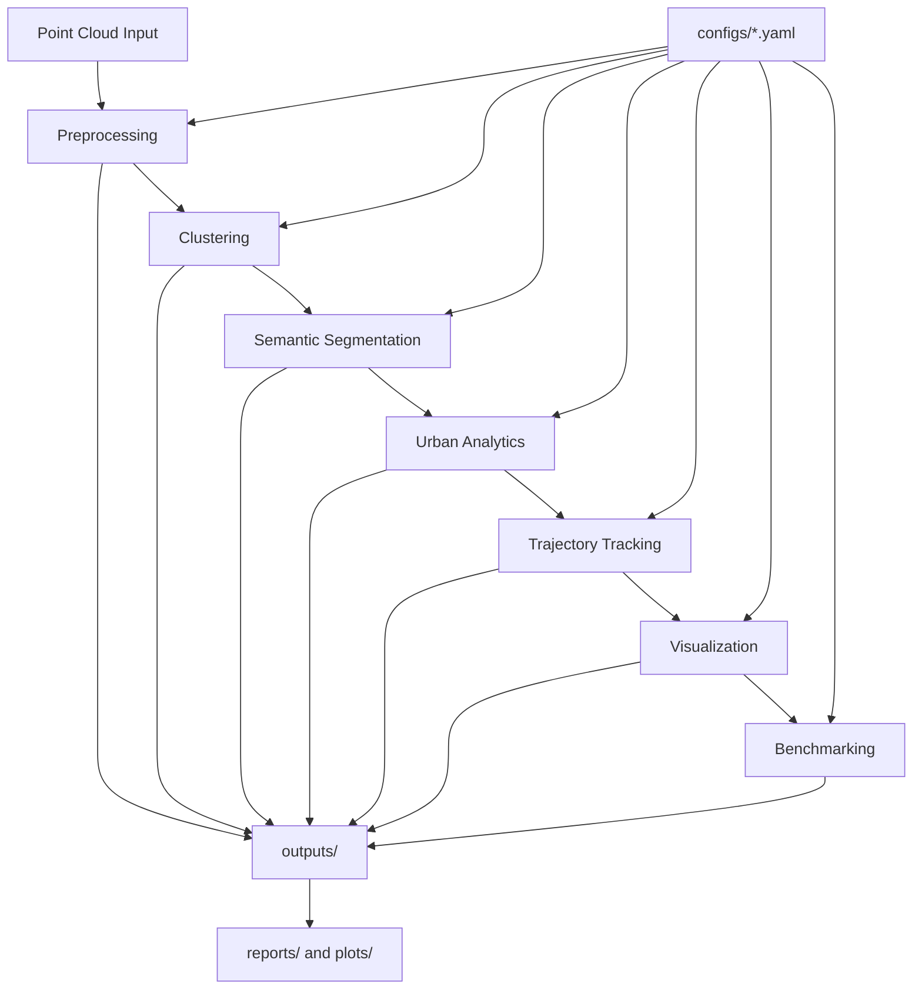

# StreetScanAI


**LiDAR Perception + Urban 3D Spatial Analytics for robotics and autonomous systems.**

StreetScanAI is a production-oriented framework for **urban point-cloud preprocessing, clustering, semantic understanding, spatial analytics, trajectory tracking, visualization, and benchmarking**.

Quick links: [Quick Start](#quick-start) · [Architecture](#architecture) · [Visualization](#visualization-results) · [Benchmarking](#benchmarking) · [Docs](#documentation) · [Русская версия](README_RU.md)

## Table Of Contents
- [Project Hero](#project-hero)
- [Feature Overview](#feature-overview)
- [Architecture](#architecture)
- [Installation](#installation)
- [Quick Start](#quick-start)
- [Visualization Results](#visualization-results)
- [Demo](#demo)
- [Benchmarking](#benchmarking)
- [Project Structure](#project-structure)
- [Roadmap](#roadmap)
- [Contributing](#contributing)
- [FAQ](#faq)
- [Troubleshooting](#troubleshooting)

## Project Hero
- Domain: **Computer Vision / LiDAR / 3D Perception / Robotics**
- Focus: **Urban scene understanding and spatial AI analytics**
- Stack: **Python, Open3D, PyVista, NumPy, pandas, scikit-learn, matplotlib**

## Feature Overview
- LiDAR point-cloud preprocessing with configurable filtering and ground removal
- Object-level clustering (DBSCAN and Euclidean-style)
- Semantic labeling baseline + PointNet++ integration contract
- Urban analytics (density, occupancy, traffic, pedestrian flow, visibility)
- Multi-frame trajectory tracking with Kalman filtering and smoothing
- Rendering pipeline for semantic/cluster/bird-eye/trajectory outputs
- Reproducible benchmarking across subsystem configurations
- Unified CLI orchestration via `uv run src/cli.py <command>`

## Architecture


## Installation
```bash
uv sync
```

## Quick Start
Run from repository root:

```bash
uv run src/cli.py preprocess --input data/raw/sample.ply --output-dir outputs/pointclouds/preprocessed
uv run src/cli.py cluster --input outputs/pointclouds/preprocessed/sample_preprocessed.ply --output-dir outputs/clusters --method dbscan
uv run src/cli.py segment --input outputs/pointclouds/preprocessed/sample_preprocessed.ply --output-dir outputs/semantic --method baseline
uv run src/cli.py analyze --input outputs/pointclouds/preprocessed/sample_preprocessed.ply --output-dir outputs/analytics
uv run src/cli.py track --input data/trajectories/urban_detections.csv --output-dir outputs/trajectories --fps 10
uv run src/cli.py visualize --input outputs/pointclouds/preprocessed/sample_preprocessed.ply --output-dir outputs/visualizations --camera-view isometric
uv run src/cli.py benchmark --input data/raw/sample.ply --output-dir outputs/benchmarks --modes preprocessing clustering --repetitions 3
```

## Visualization Results
- Semantic point cloud: `assets/semantic_example.png`  
  Expected: class-colored urban LiDAR scene.
- Clustered scene: `assets/clustering_example.png`  
  Expected: deterministic cluster colors + noise in gray.
- Bird-eye view: `assets/bird_eye_example.png`  
  Expected: top-down projected density/semantic distribution.
- Trajectory visualization: `assets/trajectory_example.png`  
  Expected: object paths in XY with direction hints.
- Density heatmap / occupancy: generated in `outputs/visualizations` and `outputs/plots/analytics`.
- Benchmark plots: `assets/benchmark_example.png`  
  Expected: runtime/throughput comparison bars.

## Demo
- `assets/demo.gif`: full pipeline showcase (expected)
- `assets/semantic_demo.gif`: semantic rendering evolution (expected)
- `assets/trajectory_demo.gif`: tracking timeline visualization (expected)

To regenerate demo-ready outputs, run CLI pipeline commands in [Quick Start](#quick-start), then export visualization/animation artifacts from `outputs/`.

## Benchmarking
- Main outputs:
  - `outputs/benchmarks/benchmark_results.csv`
  - `outputs/benchmarks/benchmark_summary.json`
  - `outputs/reports/benchmark/benchmark_report.md`
- Plot outputs:
  - `outputs/plots/benchmarks/runtime_comparison.png`
  - `outputs/plots/benchmarks/points_per_second.png`
  - `outputs/plots/benchmarks/cluster_quality.png`
  - `outputs/plots/benchmarks/segmentation_accuracy.png`
  - `outputs/plots/benchmarks/point_count_reduction.png`

## Documentation
- English docs:
  - `docs/en/architecture.md`
  - `docs/en/preprocessing.md`
  - `docs/en/clustering.md`
  - `docs/en/segmentation.md`
  - `docs/en/analytics.md`
  - `docs/en/tracking.md`
  - `docs/en/visualization.md`
  - `docs/en/benchmarking.md`
  - `docs/en/cli.md`
  - `docs/en/final_report.md`
- Russian documentation is available in [README_RU.md](README_RU.md) and `docs/ru/`.

## Project Structure
```text
src/
  preprocessing/  clustering/  segmentation/
  analytics/      tracking/    visualization/
  benchmark/      io/          utils/
configs/
docs/en/ docs/ru/
outputs/
assets/
```

## Roadmap
### Completed
- [x] Preprocessing pipeline
- [x] Clustering subsystem
- [x] Semantic segmentation baseline
- [x] Urban analytics
- [x] Tracking subsystem
- [x] Visualization pipeline
- [x] Benchmarking framework
- [x] Unified CLI

### Planned
- [ ] PointNet++ production integration
- [ ] Real-time LiDAR stream ingestion
- [ ] ROS2 integration layer
- [ ] TensorRT acceleration path
- [ ] SLAM interoperability
- [ ] Edge deployment profile
- [ ] WebRTC remote visualization
- [ ] Docker-first developer environment
- [ ] Distributed benchmarking harness
- [ ] Synthetic urban scene generation

## Contributing
See `CONTRIBUTING.md` for setup, workflow, commit/branch conventions, and PR guidelines.

## FAQ
- **Can I run without semantic labels?** Yes. Optional inputs are handled with warnings.
- **Can I benchmark a directory of point clouds?** Yes, via `benchmark --input <directory>`.

## Troubleshooting
- Missing `yaml` module: install dependencies via `uv sync`
- Headless render issues: use non-interactive mode and check fallback warnings in reports
- Empty outputs: verify input path and command-specific required files

