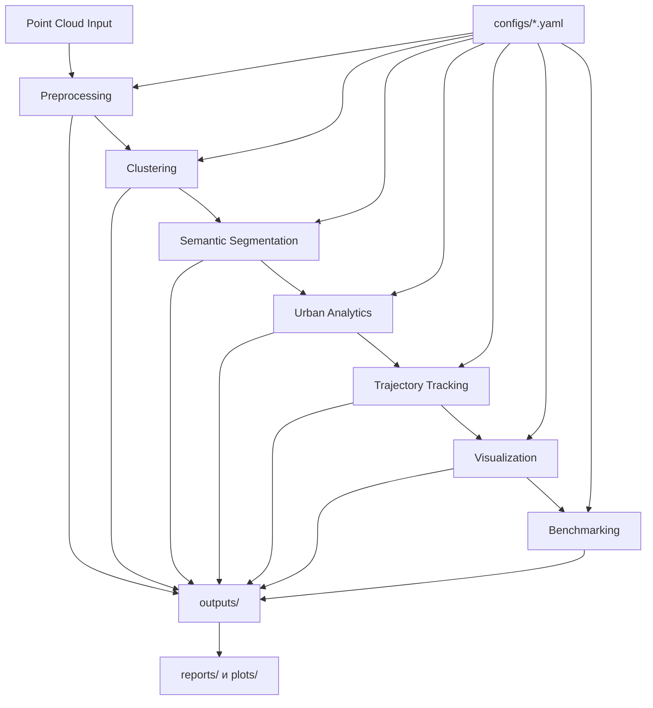

# StreetScanAI


**LiDAR-перцепция и городская 3D пространственная аналитика для робототехники и автономных систем.**

StreetScanAI — инженерный фреймворк для **предобработки облаков точек, кластеризации, семантической интерпретации, пространственной аналитики, трекинга траекторий, визуализации и бенчмаркинга**.

Быстрые ссылки: [Быстрый старт](#быстрый-старт) · [Архитектура](#архитектура) · [Визуализация](#визуализация-и-результаты) · [Бенчмаркинг](#бенчмаркинг)

## Оглавление
- [Позиционирование проекта](#позиционирование-проекта)
- [Ключевые возможности](#ключевые-возможности)
- [Архитектура](#архитектура)
- [Установка](#установка)
- [Быстрый старт](#быстрый-старт)
- [Визуализация и результаты](#визуализация-и-результаты)
- [Демо](#демо)
- [Бенчмаркинг](#бенчмаркинг)
- [Структура проекта](#структура-проекта)
- [Дорожная карта](#дорожная-карта)
- [Contributing](#contributing)
- [Лицензия](#лицензия)

## Позиционирование проекта
- Область: **Computer Vision / LiDAR / 3D Perception / Robotics**
- Фокус: **Urban Scene Understanding + Spatial AI**
- Технологии: **Python, Open3D, PyVista, NumPy, pandas, scikit-learn, matplotlib**

## Ключевые возможности
- Предобработка LiDAR-облаков точек (шумоподавление, фильтрация поверхности)
- Объектная кластеризация (DBSCAN и Euclidean-style)
- Семантическая сегментация (базовый deterministic режим + PointNet++ контракт)
- Городская аналитика (density, occupancy, traffic, pedestrian flow, visibility)
- Трекинг динамических объектов (Kalman + smoothing)
- Визуализация (semantic/cluster/bird-eye/trajectory/animation)
- Воспроизводимый бенчмаркинг конфигураций
- Единый CLI: `python src/cli.py <command>`

## Архитектура


## Установка
```bash
python -m venv .venv
# Linux/macOS
source .venv/bin/activate
# Windows PowerShell
# .venv\Scripts\Activate.ps1

pip install -r requirements.txt
```

## Быстрый старт
Запуск из корня репозитория:

```bash
python src/cli.py preprocess --input data/raw/sample.ply --output-dir outputs/pointclouds/preprocessed
python src/cli.py cluster --input outputs/pointclouds/preprocessed/sample_preprocessed.ply --output-dir outputs/clusters --method dbscan
python src/cli.py segment --input outputs/pointclouds/preprocessed/sample_preprocessed.ply --output-dir outputs/semantic --method baseline
python src/cli.py analyze --input outputs/pointclouds/preprocessed/sample_preprocessed.ply --output-dir outputs/analytics
python src/cli.py track --input data/trajectories/urban_detections.csv --output-dir outputs/trajectories --fps 10
python src/cli.py visualize --input outputs/pointclouds/preprocessed/sample_preprocessed.ply --output-dir outputs/visualizations --camera-view isometric
python src/cli.py benchmark --input data/raw/sample.ply --output-dir outputs/benchmarks --modes preprocessing clustering --repetitions 3
```

## Визуализация и результаты
- Семантический рендер: `assets/semantic_example.png`  
  Ожидание: цветовая разметка классов городской сцены.
- Кластеризация: `assets/clustering_example.png`  
  Ожидание: детерминированные цвета кластеров, noise в сером.
- Bird-eye: `assets/bird_eye_example.png`  
  Ожидание: проекция плотности/классов сверху.
- Траектории: `assets/trajectory_example.png`  
  Ожидание: траектории объектов в XY.
- Бенчмарк-плоты: `assets/benchmark_example.png`

## Демо
- `assets/demo.gif` — общий pipeline demo (ожидаемый артефакт)
- `assets/semantic_demo.gif` — семантическая визуализация (ожидаемый артефакт)
- `assets/trajectory_demo.gif` — динамика треков (ожидаемый артефакт)

## Бенчмаркинг
Ключевые выходы:
- `outputs/benchmarks/benchmark_results.csv`
- `outputs/benchmarks/benchmark_summary.json`
- `outputs/reports/benchmark/benchmark_report.md`
- `outputs/plots/benchmarks/*.png`

## Структура проекта
```text
src/
  preprocessing/  clustering/  segmentation/
  analytics/      tracking/    visualization/
  benchmark/      io/          utils/
configs/
docs/en/ docs/ru/
outputs/
assets/
```

## Дорожная карта
### Реализовано
- [x] Preprocessing pipeline
- [x] Clustering subsystem
- [x] Semantic segmentation baseline
- [x] Urban analytics
- [x] Tracking subsystem
- [x] Visualization pipeline
- [x] Benchmarking framework
- [x] Unified CLI

### В планах
- [ ] Production-интеграция PointNet++
- [ ] Реальное время (LiDAR streaming)
- [ ] ROS2 support
- [ ] TensorRT optimization
- [ ] SLAM integration
- [ ] Edge deployment
- [ ] WebRTC visualization
- [ ] Docker environment
- [ ] Distributed benchmarking
- [ ] Synthetic urban scene generation

## Contributing
См. `CONTRIBUTING.md`.

## Лицензия
MIT, см. `LICENSE`.
